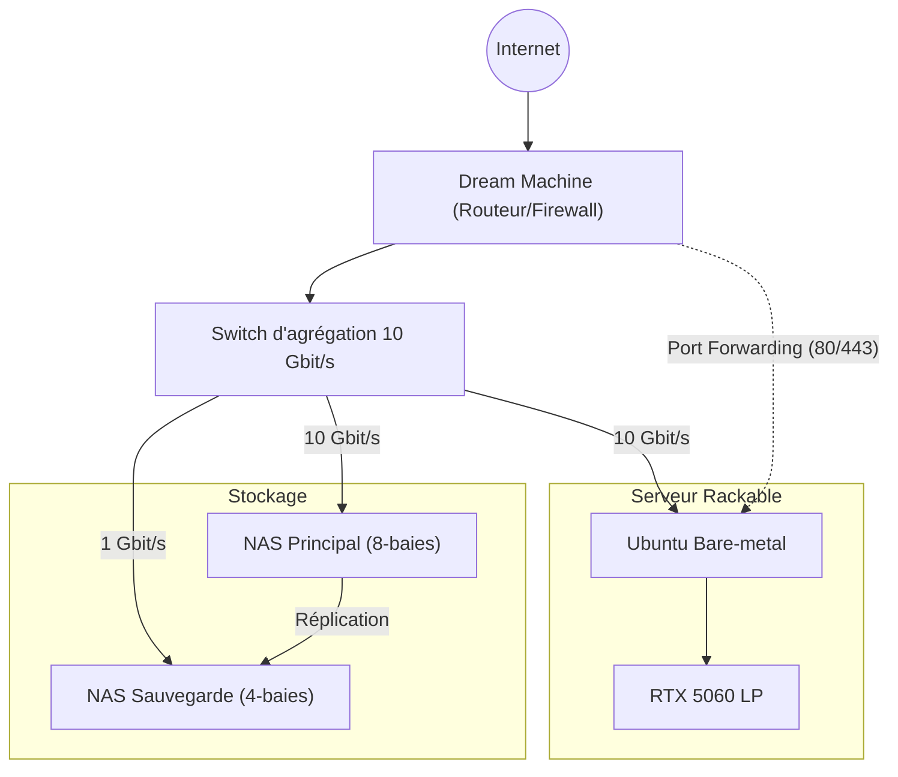
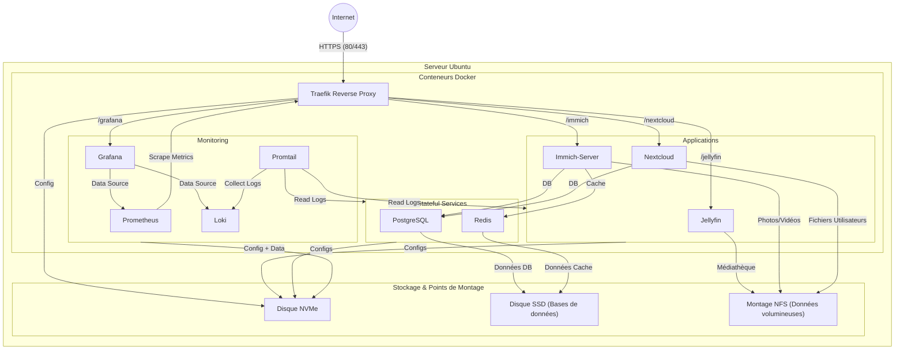

# EpiceaInfra - Mon Infrastructure Personnelle en tant que Code (IaC)

Ce dépôt contient l'ensemble de la configuration de mon infrastructure personnelle. L'objectif est de tout gérer de manière déclarative et automatisée, en minimisant les interventions manuelles.

## 🎯 Objectif & Philosophie

1.  **100 % IaC** : Tout est versionné dans Git. Pas de configuration manuelle "sauvage".
2.  **Réduction du SSH** : Les interventions se font par `git push`, pas par des connexions manuelles.
3.  **Fiabilité > Performance** : La stabilité et la facilité de maintenance sont prioritaires.

---

## 📊 Schémas d'Infrastructure

### Architecture Matérielle & Réseau

Le **Dream Machine** agit comme routeur/pare-feu. Le **Switch d'agrégation** est le cœur du réseau local, connectant le serveur et les unités de stockage à 10 Gbit/s.



### Architecture Applicative (Conteneurs Docker)

Ce schéma montre comment les services conteneurisés interagissent et où leurs données sont stockées sur le serveur.



---

## 🚀 Guide du Développeur

Cette section explique comment utiliser ce dépôt pour tester et déployer l'infrastructure.

### 1. Prérequis

Assurez-vous d'avoir installé les outils suivants sur votre poste de travail :
*   [Ansible](https://docs.ansible.com/ansible/latest/installation_guide/intro_installation.html)
*   [Make](https://www.gnu.org/software/make/)
*   [Multipass](https://multipass.run/)

### 2. Workflow de Développement

Voici les étapes pour développer et tester des changements sur l'infrastructure :

1.  **Initialiser l'environnement de test** : Une seule fois, lancez la commande suivante pour créer les machines virtuelles locales.
    ```bash
    make vm-up
    ```

2.  **Développer et Tester** : Après avoir modifié le code Ansible, appliquez vos changements sur l'environnement de test avec :
    ```bash
    make test-deploy
    ```
    Vous pouvez lancer cette commande autant de fois que nécessaire pour valider votre travail.

3.  **Accéder au shell de la VM (si besoin)** : Pour inspecter l'état de la machine de test ou pour débugger, vous pouvez ouvrir un shell interactif :
    ```bash
    multipass exec epicea-test -- bash
    ```

> **Note importante** : L'environnement de test basé sur Multipass n'est **pas iso-production**. Il ne réplique pas l'architecture matérielle (disques spécifiques, GPU, etc.). Cependant, il offre un environnement suffisamment proche pour valider la logique des playbooks Ansible et le déploiement des services Docker.

### 3. Commandes du `Makefile`

Le `Makefile` est le point d'entrée unique pour toutes les opérations.

| Commande                | Description                                                                                             |
| ----------------------- | ------------------------------------------------------------------------------------------------------- |
| **Tests (Multipass)**   |                                                                                                         |
| `make vm-up`      | Crée les machines virtuelles de test via le script `scripts/multipass/setup-vms.sh`.                    |
| `make vm-down`    | Détruit les machines virtuelles de test.                                                                |
| `make test-init`        | Crée un fichier `vault.yml` non chiffré pour les tests, s'il n'existe pas.                              |
| `make test-deploy`      | Déploie la configuration Ansible sur l'environnement de test.                                           |
| `make test-status`      | Affiche le statut des conteneurs Docker sur l'environnement de test.                                    |
| **Production**          |                                                                                                         |
| `make init`             | Crée et chiffre un nouveau fichier `vault.yml` pour la production, s'il n'existe pas.                   |
| `make secrets`          | Ouvre le fichier `vault.yml` chiffré pour l'édition.                                                    |
| `make deploy`           | **(Action critique)** Déploie la configuration sur la production (demande le mot de passe du vault).    |
| `make status`           | Affiche le statut des conteneurs Docker en production.                                                  |
| **Validation**          |                                                                                                         |
| `make validate`         | Vérifie la syntaxe des playbooks Ansible.                                                               |

---

## 📜 Contexte de l'Évolution

*   **Point de Départ** : Serveur unique sous Proxmox avec stockage ZFS local. La gestion des VMs et du stockage était devenue trop complexe et rigide.
*   **Cible** : Passer à un serveur **Ubuntu Bare-metal** pour la simplicité, avec le stockage entièrement externalisé sur des **NAS Ubiquiti** et un réseau unifié à **10 Gbit/s** pour des performances optimales entre le calcul et les données. Une **GPU NVIDIA** est ajoutée pour les besoins en IA et transcodage.
